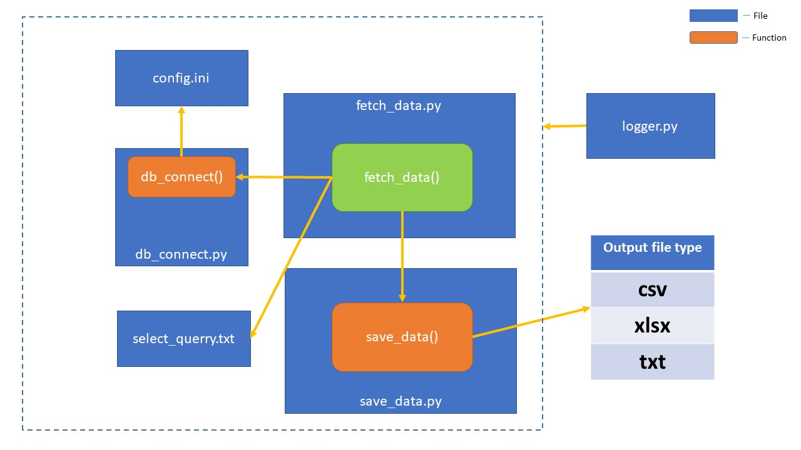

# python-database-example

  This project illustrates how to connect database with python and perform operations. There are two triggers i.e. fetch_data.py (Fetch data of a table from a given database) and insert_data.py (Fetch data from given file and insert to database) .
  
  
  ## fetch_data.py
  
  
  As you can see that fetch_data() is the trigger function.The command to execute the fetch_data.py  
  is: 
    
    python fetch_data.py -c config.ini -d mysql -q select_querry.txt -o xlsx
    
  The fetch_data() takes 4 parameters i.e. 
  
    config_path - path of the conifg file with file name
    db_name - name of the database
    querry_file - name of the querry file
    outfile_type - type of the file in which the fetch data is saved
      
  Then the fetch_data() function call the db_connect() function of db_connect.py file which is       
  responssible for taking the credentials from config.ini file and connect to the database.
  db_connect() function take 2 parameters i.e.
  
      config_path - path of the conifg file with file name
      db_name - name of the database
      
  After getting connected to the database; fetch_data() function will read the fetching querry from     the select_query.txt file and get all the data.
  
  Then fetch_data() function will call to the save_data() function of sava_data.py file.
  save_data() function take 2 parameters i.e.
  
      cursor - cursor object from the fetch_data.py file
      outfile_type - type of the file in which the fetch data is saved
      
  Then according to the to the file type; same file type will be created and the data is going to
  save in the respective file type.
  In my project; there is 3 types of file in which user can save the data i'e. (.csv, .xlsx, .txt) .
    
  Finally all the operation will be logged in the log directory.
  
  
  
  ## insert_data.py
  
  
  As you can see that insert_data() is the trigger function.The command to execute the insert_data.py
  is: 
    
    python insert_data.py -c config.ini -d mysql -r record.csv -q insert_query.txt
    
  The insert_data() function also takes 4 parameters:
  
    config_path - path of the conifg file with file name
    db_name - name of the database
    record_path - name of the record file
    querry_file - name of the querry file
    
  Then the insert_data() function will call to db_connect() function and connect to the database by
  collecting the credentials from config.ini file.
  
  After getting connected to the database; insert_data() function will read the datas from the given
  record file type(either .csv or .xlsx) and then save all the datas into
  the database by executing the insertion querry from insert_query.txt file. 
  
  Finally all the operation will be logged in the log directory.
